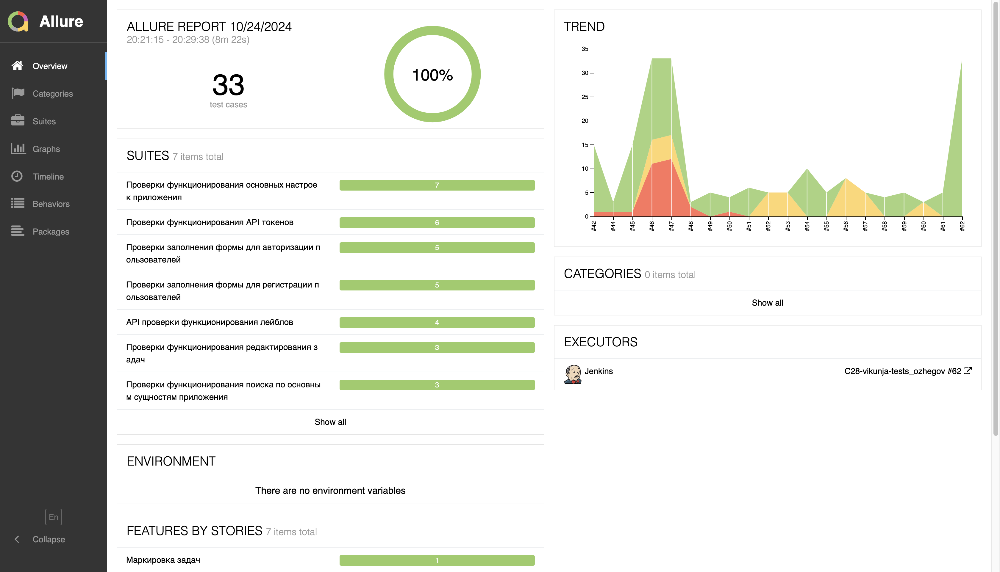
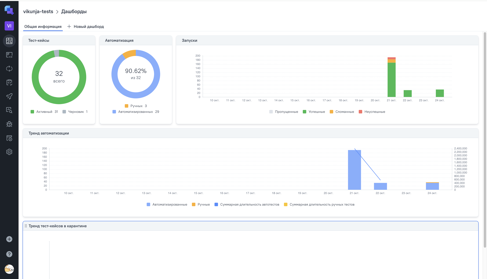

# Проект по автоматизации тестирования приложения **[Vikunja](https://vikunja.io)**

<p align="center">

</p>

## **Содержание:**

1. <a href="#description">Описание</a>

2. <a href="#tools">Используемые инструменты</a>

3. <a href="#cases">Примеры реализованных проверок</a>

4. <a href="#console">Запуск тестов</a>

    * <a href="#combinations">Допустимые комбинации</a>

    * <a href="#local">Локальный запуск</a>
    
    * <a href="#remote">Удаленный запуск</a>

5. <a href="#jenkins">Сборка в Jenkins</a>

6. <a href="#integrations">Интеграции</a>

    * <a href="#allure">Интеграция с Allure Report</a>

    * <a href="#allure-testops">Интеграция с Allure TestOps</a>

    * <a href="#jira">Интеграция с Jira</a>

7. <a href="#telegram">Уведомления в Telegram при помощи бота</a>

8. <a href="#video">Примеры выполнения тестов</a>
---
<a id="description"></a>
## <a name="Описание">**Описание:**</a>
Vikunja — приложение для управления задачами с открытым исходным кодом, которое предлагает пользователям возможность самостоятельной установки и настройки.<br/>

**Особенности проекта**:
- UI-тесты, API и мобильные тесты на Android в одном проекте
- Использование шаблона проектирования Page Object
- Вариативность запуска тестов: локально, удалённо, по тегам
- Конфигурирование с помощью библиотеки [Owner](https://matteobaccan.github.io/owner/):
    - Основные конфигурационные параметры хранятся в отдельных файлах
    - Сенситивная информация (логины, пароли от приложения и сторонних сервисов) не хранится напрямую в проекте, а в отдельно формируемом при сборке в Jenkins файле
- Использование кастомных расширений JUnit 5:
    - Аннотация @WithLogin - предварительная авторизация по API
    - Аннотация @WithAuthLogin - предварительная регистрация по API с последующей авторизацией под созданным аккаунтом
    - Аннотация @WithMobileAuthLogin - предварительная регистрация по API с последующей авторизацией под созданным аккаунтом в мобильном приложении
- Использование параметризованных тестов @ParameterizedTest
- Генерация тестовых данных с помощью библиотеки [Faker](https://matteobaccan.github.io/owner/)
- С помощью бибилотеки [Lombok](https://projectlombok.org) запросы и ответы в API тестах описаны отдельными моделями  
- Формирование подробного очтета о результатах прохождения тестов с использованием [Allure Report](https://allurereport.org):
    - Все автотесты имеют подробное описание каждого шага
    - По итогам прохождения теста к отчету прикрепляется:
        - Видео выполнения теста
        - Скриншот страницы на последнем шаге
        - Логи консоли браузера
        - Исходных код страницы
- Интеграция с TMS системой Allure TestOps и баг-трекинговой системой Jira:
    - Запуск автоестов прямо из Allure TestOps
    - Возможность прикрепления результатов выполнения тестов в Jira
- Настроена отправка уведомлений в Telegram о результатах прохождения тестов
  
<a id="tools"></a>
## <a name="Используемые инструменты">**Используемые инструменты:**</a>
<p align="center">
  <a href="https://www.jetbrains.com/idea/"></a>
  <a href="https://www.java.com/"></a>
  <a href="https://selenide.org/"></a>
  <a href="https://junit.org/junit5/"></a>
  <a href="https://rest-assured.io/"></a>
  <a href="https://www.browserstack.com/"></a>
  <a href="https://appium.io/"></a>
  <a href="https://developer.android.com/studio"></a>
  <a href="https://aerokube.com/selenoid/"></a>
  <a href="https://gradle.org/"></a>
  <a href="https://www.jenkins.io/"></a>
  <a href="https://allurereport.org"></a>
  <a href="https://qameta.io/"></a>
  <a href="https://www.atlassian.com/software/jira"></a>
  <a href="https://telegram.org/"></a>
</p>

<a id="cases"></a>
## <a name="Примеры реализованных проверок">**Примеры реализованных проверок:**</a>

### Web
- [x] *При регистрации с валидными данными пользователю отображается приветственное сообщение*
- [x] *При попытке регистрации с уже используемым логином отображается сообщение об ошибке*
- [x] *При изменении темы приложения в настройках цвет приложения меняется в соответствии с выбранной темой*
- [x] *При вводе в поле поиска символа '@' перед названием команды в результатах поиска отображается название искомой команды*

### Api
- [x] *При создании нового токена c валидными данными его название корректно отображается в ответе метода*
- [x] *При создании нового токена с датой истечения в некорректном формате в ответе метода отображается сообщение об ошибке*
- [x] *При добавлении принадлежащего пользователю лейбла к задаче дата его создания в ответе метода соответствует текущей*
- [x] *При добавлении лейбла с несуществующим ID к задаче в ответе метода отображается сообщение об ошибке*

### Mobile
- [x] *При авторизации с валидными данными пользователю отображается домашний экран*
- [x] *При попытке авторизации с некорректным паролем на экране отображается сообщение об ошибке и авторизация не происходит*
- [x] *При изменении приоритета задачи новый приоритет отображается в списке задач*

<a id="console"></a>
## Запуск тестов
> [!NOTE]
> Для запуска любых тестов потребуются установленные Java, Gradle, IntelliJ IDEA.
>

<a id="combinations"></a>
### Допустимые комбинации

### Запуск по типу тестов


### Запуск по разделам приложения

```mermaid 
flowchart LR
    A(gradle) --> B(clean)
    B --> C{Выбрать тег}
    C --> D[test]
    C --> E[registration] --> M[-DremoteHost]
    C --> F[general_settings] --> M[-DremoteHost]
    C --> L[search] --> M[-DremoteHost]
    C --> G[label]
    C --> H[token]
    C --> J[login] --> N[-DdeviceHost]
    C --> K[task] --> N[-DdeviceHost]
```
<a id="local"></a>
### Локальный запуск

<a id="remote"></a>
### Удаленный запуск

<a id="integrations"></a>
## Интеграции

<a id="jenkins"></a>
### </a><a name="Сборка в Jenkins"></a>Сборка в [Jenkins](https://jenkins.autotests.cloud/job/C27-universe_data_ui_tests/)</a>

<p align="center">  
  
</p>

<a id="allure"></a>
### </a><a name="Интеграция с Allure Report"></a>Интеграция с [Allure Report](https://jenkins.autotests.cloud/job/C27-universe_data_ui_tests/allure/)</a>

#### *Основная страница отчёта*

<p align="center">  
  
</p>  

#### *Тест-кейсы*

<p align="center">  
  
</p>

#### *Графики*

  <p align="center">  

</p>

<a id="allure-testops"></a>
### </a><a name="Интеграция с Allure TestOps"></a>Интеграция с [Allure TestOps](https://allure.autotests.cloud/project/4337/)</a>

#### *Dashboard*

<p align="center">  
  
</p>  

#### *Автоматизированные тест-кейсы*

<p align="center">  
  
</p>

#### *Ручные тест-кейсы*

<p align="center">  

</p>

<a id="jira"></a>
### </a><a name="Интеграция с Jira"></a>Интеграция с [Jira]()</a>

<p align="center">  
  
</p>

<a id="telegram"></a>
## </a><a name="Уведомления в Telegram при помощи бота"></a>Уведомления в Telegram при помощи бота</a>
<p align="center">  
  
</p>

<a id="video"></a>
## </a><a name="Примеры выполнения тестов"></a>Примеры выполнения тестов</a>

### Web
<p align="center">  
  
</p>

### Mobile
<p align="center">  
  
</p>
