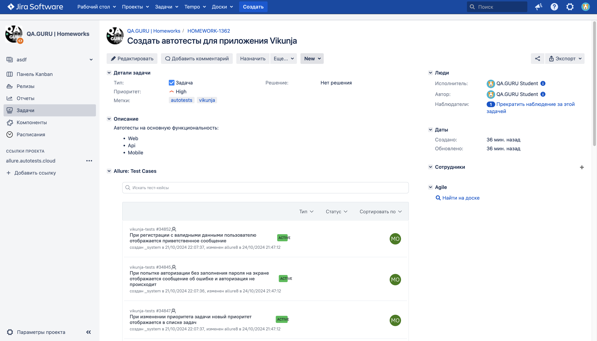

# Проект по автоматизации тестирования приложения **[Vikunja](https://vikunja.io)**

<p align="center">

</p>

## **Содержание:**

1. <a href="#description">Описание</a>

2. <a href="#tools">Используемые инструменты</a>

3. <a href="#cases">Примеры реализованных проверок</a>

4. <a href="#console">Запуск тестов</a>

    * <a href="#combinations">Допустимые комбинации</a>

    * <a href="#local">Локальный запуск</a>
    
    * <a href="#remote">Удаленный запуск</a>

5. <a href="#jenkins">Сборка в Jenkins</a>

6. <a href="#integrations">Интеграции</a>

    * <a href="#allure">Интеграция с Allure Report</a>

    * <a href="#allure-testops">Интеграция с Allure TestOps</a>

    * <a href="#jira">Интеграция с Jira</a>

7. <a href="#telegram">Уведомления в Telegram при помощи бота</a>

8. <a href="#video">Примеры выполнения тестов</a>
---
<a id="description"></a>
## <a name="Описание">**Описание:**</a>
Vikunja — приложение для управления задачами с открытым исходным кодом, которое предлагает пользователям возможность самостоятельной установки и настройки.<br/>

**Особенности проекта**:
- UI-тесты, API и мобильные тесты на Android в одном проекте
  
- Использование шаблона проектирования Page Object
- Вариативность запуска тестов: локально, удалённо, по тегам
- Конфигурирование с помощью библиотеки [Owner](https://matteobaccan.github.io/owner/):
    - Основные конфигурационные параметры хранятся в отдельных файлах
    - Сенситивная информация (логины, пароли от приложения и сторонних сервисов) не хранится напрямую в проекте, а в отдельно формируемом при сборке в Jenkins файле
- Использование кастомных расширений JUnit 5:
    - Аннотация @WithLogin - предварительная авторизация по API
    - Аннотация @WithAuthLogin - предварительная регистрация по API с последующей авторизацией под созданным аккаунтом
    - Аннотация @WithMobileAuthLogin - предварительная регистрация по API с последующей авторизацией под созданным аккаунтом в мобильном приложении
- Использование параметризованных тестов @ParameterizedTest
- Генерация тестовых данных с помощью библиотеки [Faker](https://matteobaccan.github.io/owner/)
- С помощью бибилотеки [Lombok](https://projectlombok.org) запросы и ответы в API тестах описаны отдельными моделями  
- Формирование подробного очтета о результатах прохождения тестов с использованием [Allure Report](https://allurereport.org):
    - Все автотесты имеют подробное описание каждого шага
    - По итогам прохождения теста к отчету прикрепляется:
        - Видео выполнения теста
        - Скриншот страницы на последнем шаге
        - Логи консоли браузера
        - Исходных код страницы
- Интеграция с TMS системой Allure TestOps и баг-трекинговой системой Jira:
    - Запуск автоестов прямо из Allure TestOps
    - Возможность прикрепления результатов выполнения тестов в Jira
- Настроена отправка уведомлений в Telegram о результатах прохождения тестов
  
<a id="tools"></a>
## <a name="Используемые инструменты">**Используемые инструменты:**</a>
<p align="center">
  <a href="https://www.jetbrains.com/idea/"></a>
  <a href="https://www.java.com/"></a>
  <a href="https://selenide.org/"></a>
  <a href="https://junit.org/junit5/"></a>
  <a href="https://rest-assured.io/"></a>
  <a href="https://www.browserstack.com/"></a>
  <a href="https://appium.io/"></a>
  <a href="https://developer.android.com/studio"></a>
  <a href="https://aerokube.com/selenoid/"></a>
  <a href="https://gradle.org/"></a>
  <a href="https://www.jenkins.io/"></a>
  <a href="https://allurereport.org"></a>
  <a href="https://qameta.io/"></a>
  <a href="https://www.atlassian.com/software/jira"></a>
  <a href="https://telegram.org/"></a>
</p>

<a id="cases"></a>
## <a name="Примеры реализованных проверок">**Примеры реализованных проверок:**</a>

### Web
- [x] *При регистрации с валидными данными пользователю отображается приветственное сообщение*
- [x] *При попытке регистрации с уже используемым логином отображается сообщение об ошибке*
- [x] *При изменении темы приложения в настройках цвет приложения меняется в соответствии с выбранной темой*
- [x] *При вводе в поле поиска символа '@' перед названием команды в результатах поиска отображается название искомой команды*

### Api
- [x] *При создании нового токена c валидными данными его название корректно отображается в ответе метода*
- [x] *При создании нового токена с датой истечения в некорректном формате в ответе метода отображается сообщение об ошибке*
- [x] *При добавлении принадлежащего пользователю лейбла к задаче дата его создания в ответе метода соответствует текущей*
- [x] *При добавлении лейбла с несуществующим ID к задаче в ответе метода отображается сообщение об ошибке*

### Mobile
- [x] *При авторизации с валидными данными пользователю отображается домашний экран*
- [x] *При попытке авторизации с некорректным паролем на экране отображается сообщение об ошибке и авторизация не происходит*
- [x] *При изменении приоритета задачи новый приоритет отображается в списке задач*

<a id="console"></a>
## Запуск тестов
> [!NOTE]
> Для запуска любых тестов потребуются установленные Java, Gradle, IntelliJ IDEA.
>

<a id="combinations"></a>
### Допустимые комбинации

### Запуск по типу тестов


### Запуск по разделам приложения


<a id="local"></a>
### Локальный запуск

Для запуска потребуется открыть IntelliJ IDEA и выполнить в терминале команды.

> [!NOTE]
> Перед запусками тестов в папке <code>resources/config</code> необходимо создать файл <code>auth.properties</code> и поместить туда: <br/>
>
> <code>vikunjaUsername</code> - логин зарегистрированного в приложении пользователя <br/>
> <code>vikunjaPassword</code> - логин зарегистрированного в приложении пользователя <br/>
> <code>vikunjaServerAddress</code> - адрес сервера, на котором развернуто мобильное приложение <br/>
> 
> **Пример файла:** <br/>
> ```
> vikunjaUsername=user12345
> vikunjaPassword=Test12345
> vikunjaServerAddress=https://try.vikunja.io
> ```
> При использовании адреса сервера демо-версии приложения https://try.vikunja.io зарегистрировать пользователя можно по [ссылке](https://try.vikunja.io/register)

#### Все тесты

```bash
gradle clean test
```

##### UI-тесты

```bash
gradle clean web
```
###### UI-тесты на проверку регистрации
```bash
gradle clean registration
```
###### UI-тесты на проверку поиска
```bash
gradle clean search
```
###### UI-тесты на проверку настроек приложения
```bash
gradle clean general_settings
```
**Конфигурационные параметры:**

<code>-DbaseUrl</code> - адрес сервера (веб-интерфейс), на котором развернуто приложение (по умолчанию: <code>https://try.vikunja.io</code>) <br/>
<code>-DbaseURI</code> - адрес сервера (API), на котором развернуто приложение (по умолчанию: <code>https://try.vikunja.io</code>) <br/>
<code>-Dbrowser</code> - наименования браузера для запуска тестов (по умолчанию: <code>chrome</code>) <br/>
<code>-DbrowserSize</code> - размер окна браузера (по умолчанию: <code>1920x1080</code>) <br/>
<code>-DbrowserVersion</code> - номер версии браузера (по умолчанию: <code>120.0</code>) <br/>

##### API-тесты

```bash
gradle clean api
```
###### API-тесты на проверку функционирования токенов
```bash
gradle clean token
```
###### API-тесты на проверку функционирования лейблов
```bash
gradle clean label
```
##### Mobile-тесты

```bash
gradle clean mobile
```

> [!NOTE]
> Перед запусками тестов необходимо дополнительно установить: <br/>
> 
> * Запуск с использованием эмулятора - Android Studio и Appium Server - [инcтрукция по настройке](https://autotest.how/appium-setup-for-local-android-tutorial-md)
>   
> * Запуск с использованием эмулятора - Appium Server и в файле <code>resources/config/real.properties</code> указать <code>platformVersion</code> и <code>deviceName</code> вашего устройства

###### Mobile-тесты на проверку функционирования авторизации

```bash
gradle clean login
```

###### Mobile-тесты на проверку функционирования задач

```bash
gradle clean task
```

**Конфигурационные параметры:**

<code>-DdeviceHost</code> - метод запуска тестов. По умолчанию: <code>browserstack</code> - удаленный запуск тестов, необходимо заменить на: <br/>
   - <code>-DdeviceHost=emulation</code> - для запуска на эмуляторе через Android Studio <br/>
   - <code>-DdeviceHost=real</code> - для запуска на реальном устройстве <br/>

<a id="remote"></a>
### Удаленный запуск

Тесты можно запустить из терминала IntelliJ IDEA, а выполнены они будут в удаленно запущенном браузере в Selenoid.

> [!NOTE]
> Перед запусками тестов в папке <code>resources/config</code> необходимо создать файл <code>auth.properties</code> и поместить туда: <br/>
>
> <code>vikunjaUsername</code> - логин зарегистрированного в приложении пользователя <br/>
> <code>vikunjaPassword</code> - логин зарегистрированного в приложении пользователя <br/>
> <code>vikunjaServerAddress</code> - адрес сервера, на котором развернуто мобильное приложение <br/>
> <code>browserstackUsername</code> - username пользователя в BrowserStack <br/>
> <code>browserstackPassword</code> - access key пользователя в BrowserStack <br/>
> <code>selenoidUsername</code> - логин от вашего сервера Selenoid <br/>
> <code>selenoidPassword</code> - пароль от вашего сервера Selenoid <br/>
>
> **Пример файла:** <br/>
> ```
> vikunjaUsername=user12345
> vikunjaPassword=Test12345
> vikunjaServerAddress=https://try.vikunja.io
> browserstackUsername=maksim_giTrYB
> browserstackPassword=qbe6Mp43а3а3DUK7z
> selenoidUsername=user1324324
> selenoidPassword=32324
> ```
> - При использовании адреса сервера демо-версии приложения https://try.vikunja.io зарегистрировать пользователя можно по [ссылке](https://try.vikunja.io/register) <br/>
> - Зарегистрироваться бесплатно в BrowserStack можно по [ссылке](https://www.browserstack.com/users/sign_up)

##### UI-тесты

**Конфигурационные параметры:**
Параметры аналогичны параметрам при локальном запуске, а также:
<code>-DremoteHost</code> - адрес вашего удаленного сервера, на котором будут запускаться тесты (по умолчанию не задан - тесты будут запускаться локально)

##### Mobile-тесты

**Конфигурационные параметры:**
Параметры аналогичны параметрам при локальном запуске, а также:
<code>--DdeviceName</code> - мобильное устройство для запуска тестов в BrowserStack (по умолчанию: <code>samsung</code>) <br/>
   - <code>-DdeviceHost=samsung</code> - для запуска на Samsung Galaxy S22 Ultra <br/>
   - <code>-DdeviceHost=redmi</code> - для запуска на Xiaomi Redmi Note 11 v.11.0 <br/>

> [!NOTE]
> Возможно добавить новые мобильные устройства для запусков тестов в BrowserStack. Для этого в папке <code>resources/config/browserstack</code> необходимо создать файл <code>*название_устройства*.properties</code> и поместить туда: <br/>
>
> <code>app</code> - адрес приложения в BrowserStack <br/>
> <code>device</code> - название девайса <br/>
> <code>version</code> - версия ОС <br/>
> <code>project</code> - название проекта <br/>
> <code>build</code> - название билда <br/>
> <code>remoteUrl=https://hub.browserstack.com/wd/hub</code> - адрес удаленного сервера BrowserStack (остается неизменным) <br/>
> 
> **Пример файла:** <br/>
> ```
> app=bs://7ae582e9f72cb3ebd6ee90d18199755709133876
> device=Google Pixel 8 Pro
> version=14.0
> project=Vikunja Mobile Tests
> build=browserstack-vikunja-pixel-build
> remoteUrl=https://hub.browserstack.com/wd/hub
> ```
> Чтобы загрузить приложение в BrowserStack можно воспользоваться [инcтрукцией](https://www.browserstack.com/docs/app-automate/api-reference/appium/apps).<br/>
> [Ссылка](https://github.com/go-vikunja/app/releases/download/0.1.8-beta/app-production-release-0.1.8-beta.apk) на мобильное приложение Vikunja на GitHub.


<a id="jenkins"></a>
## </a><a name="Сборка в Jenkins"></a>Сборка в [Jenkins](https://jenkins.autotests.cloud/job/C28-vikunja-tests_ozhegov)</a>

<p align="center">  
  
</p>

Для запуска сборки необходимо перейти в раздел <code>Build with Parameters</code>, выбрать параметры сборки и нажать кнопку <code>Build</code>

<p align="center">  
  
</p>

<a id="integrations"></a>
## Интеграции
<a id="allure"></a>
### </a><a name="Интеграция с Allure Report"></a>Интеграция с [Allure Report](https://jenkins.autotests.cloud/job/C28-vikunja-tests_ozhegov/allure/)</a>

#### *Основная страница отчёта*

<p align="center">  
  
</p>  

#### *Тест-кейсы*

<p align="center">  
  
</p>

#### *Графики*

  <p align="center">  

</p>

<a id="allure-testops"></a>
### </a><a name="Интеграция с Allure TestOps"></a>Интеграция с [Allure TestOps](https://allure.autotests.cloud/project/4482)</a>

#### *Dashboard*

<p align="center">  
  
</p>  

#### *Автоматизированные тест-кейсы*

<p align="center">  
  
</p>

#### *Ручные тест-кейсы*

<p align="center">  

</p>

<a id="jira"></a>
### </a><a name="Интеграция с Jira"></a>Интеграция с [Jira](https://jira.autotests.cloud/browse/HOMEWORK-1362)</a>

<p align="center">  
  
</p>

<a id="telegram"></a>
## </a><a name="Уведомления в Telegram при помощи бота"></a>Уведомления в Telegram при помощи бота</a>
<p align="center">  
  
</p>

<a id="video"></a>
## </a><a name="Примеры выполнения тестов"></a>Примеры выполнения тестов</a>

### Web
<p align="center">  
  
</p>

### Mobile
<p align="center">  
  
</p>
